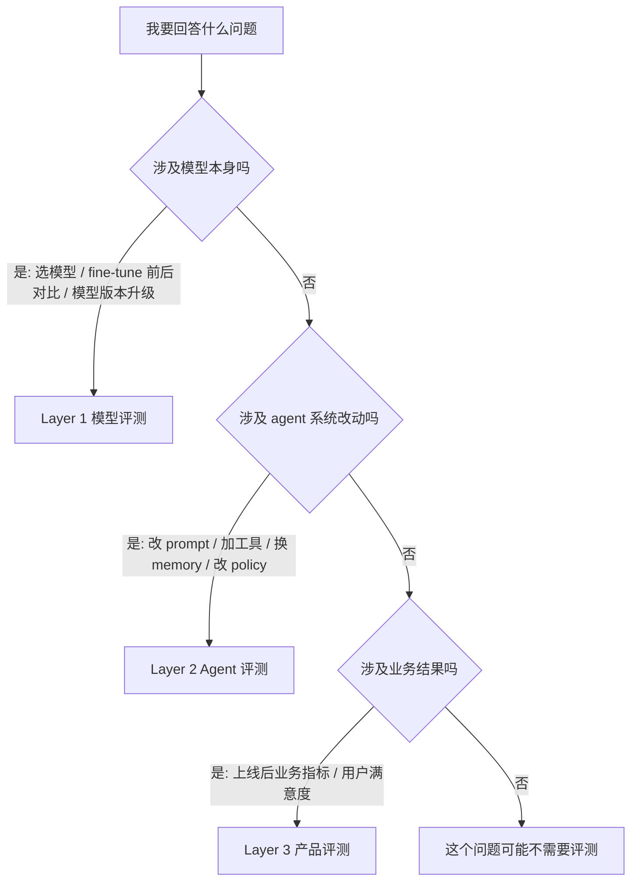

## 本章你会拿到什么

读完这一章，你会有两样东西：

1. **一张评测金字塔的心智地图**——清楚知道什么时候该用"模型评测"，什么时候该用"Agent 评测"，什么时候该用"产品评测"。这是后续 20 章的边界感来源。三者不是替代关系，是搭配关系。
2. **ShopAgent 的接口速览**——它有哪些工具、什么 policy、给读者的合约是什么。本书的 ShopAgent 仓库里**已经写好**了，我们只看它的 API 和约束，不看它怎么实现。

这一章没有代码。下一章你会跑出第一个真实评测数字。

## 评测金字塔：三层各管一段

先看图：

```
       ┌───────────────────────────────┐
       │  Layer 3：产品评测（业务指标）  │   ← CSAT、NPS、转化率、留存
       ├───────────────────────────────┤
       │  Layer 2：Agent 评测（任务级）  │   ← 任务完成率、trajectory、
       │                                │     工具调用、policy 遵守、judge
       ├───────────────────────────────┤
       │  Layer 1：模型评测（能力级）    │   ← MMLU、HumanEval、HELM、
       │                                │     pass^1、Elo、参数变化前后
       └───────────────────────────────┘
```

每一层评测的是不同的"东西"，用的是不同的指标，回答的是不同的问题。

### Layer 1：模型评测

**评的是什么**：基础模型本身的能力。把 GPT-5 / Claude Sonnet 4.5 / DeepSeek V3 / Qwen3 当作一个黑盒函数 `f(prompt) → response`，测它在标准基准上的得分。

**典型问题**：
- 我们公司要选一个国产基座模型做客服 agent 的底层。Qwen3-Max 和 DeepSeek V3 哪个更适合？
- 我们 fine-tune 了一版 Qwen3 内部专用模型，它和原版相比 MMLU / CEval / GSM8K 是涨了还是跌了？
- Claude Sonnet 4 → Sonnet 4.5 升级，我们能拿到几个点提升？

**典型工具**：MMLU、HumanEval、HELM、BIG-bench、CEval、CMMLU、SuperCLUE、MT-Bench、lm-evaluation-harness、OpenCompass。

**特点**：
- 评测对象是**模型权重本身**，不涉及 prompt 工程 / 工具 / 编排
- 数据集是**通用知识测试**，跟你的业务无关（你不会在 MMLU 上学到怎么处理退款工单）
- 指标是**accuracy / Elo / loss**，单一维度
- 看的是**pass^1**（一次成功率），因为模型对同一道题的回答相对稳定

### Layer 2：Agent 评测

**评的是什么**：模型 + prompt + 工具集 + 编排逻辑 + 记忆模块 **作为一个整体系统**，在你的业务任务上的表现。

**典型问题**：
- 我们的客服 agent 改了一行 prompt，退款流程的任务完成率是涨了还是跌了？
- 我们把 GPT-4o 换成 GPT-4o-mini 省成本，agent 在哪些 task 上崩了？
- 我们给 agent 加了一个 cross-session memory 模块，多轮任务完成率有变化吗？是涨还是跌？

**典型工具**：inspect_ai、promptfoo、Ragas、langfuse、agentevals、τ²-bench、SWE-bench、BFCL。

**特点**：
- 评测对象是**整个 agent 系统**，模型只是其中一个零件
- 数据集是**你业务领域的任务集**（电商客服 agent 用的是退款/换货/查询任务，不是 MMLU）
- 指标是**任务完成率 / trajectory 匹配 / tool 调用正确性 / state delta / judge 评分**，多维度
- 看的是 **pass^k**（同一任务独立跑 k 次、每次都成功的概率），因为 agent 系统的随机性来自工具调用、用户输入、temperature 多个源
- 经常需要 **sandbox**（agent 调用工具时要执行真实代码或模拟环境）

### Layer 3：产品评测

**评的是什么**：用户用了这个 agent 之后，业务指标变没变。

**典型问题**：
- 我们的 AI 客服上线一个月后，人工客服工单量降了多少？
- agent 服务过的用户，下次复购率比未服务的用户高多少？
- 用户对 agent 的满意度评分（CSAT）是几颗星？

**典型工具**：A/B 实验平台、数据仓库、BI dashboard、用户问卷。

**特点**：
- 评测对象是**产品 + 用户 + 业务流程**的总体表现
- 数据来自**线上真实流量**，不是离线评测集
- 指标是**业务指标**：CSAT、NPS、转化率、留存率、ARR
- 时间窗口是**周 / 月 / 季度**级别，不是单次评测分钟级别

## 三者的关系

我画一张"什么时候用哪一层"的决策图：



工程师每天 80% 的精力会花在 Layer 2 上。Layer 1 是基础课，做模型选型时上一次，定下来就不动了；Layer 3 是上线后的运营关注点，离线评测帮不了你。**写完一个 agent，没有现成数据验证它是否稳定**这个核心痛点，发生在 Layer 2。

这也是为什么本书 **80% 的章节在讲 Layer 2**——这是工程师真正需要、市面上又最缺系统化材料的层。Layer 1 在附录 A 给一节"模型评测进阶"，讲怎么用 OpenCompass 给国产模型横评；Layer 3 在附录 C 给一节，讲 Layer 2 指标怎么映射到业务指标。**主线 20 章全部是 Layer 2**。

## 三个常见的误用

工程师在三层金字塔上最常犯三个错误，每个错误都会让"评测"看起来在做，实际上没用。

### 误用 1：用 Layer 1 评测代替 Layer 2

"我们的客服 agent 用的是 GPT-4o，GPT-4o 在 MMLU 上 88.7 分，所以我们的 agent 没问题。"

错。MMLU 测的是模型在标准知识题上的表现，跟你的客服业务零相关。一个 MMLU 92 分的模型，在你的 agent 上可能因为工具调用格式不对、policy 遵守不到位，任务完成率只有 40%。Layer 1 高不代表 Layer 2 高。Layer 2 必须用你业务的任务集自己测。

### 误用 2：用 Layer 3 评测代替 Layer 2

"我们的 AI 客服上线后用户满意度 80%，所以 agent 质量没问题。"

错。CSAT 80% 这种业务指标包含太多噪声：用户对 UI 满意、对响应速度满意、对没等人工满意，都会拉高 CSAT。但你 agent 实际的工具调用错误率可能是 20%——大部分错误用户根本没发现，或者发现了懒得给低分。Layer 3 是滞后指标，发现问题已晚；Layer 2 是前置指标，能在上线前抓到问题。

**真实代价**：作者见过一个团队上线 6 周才发现 agent 退款金额诱导漏洞——前 5 周 CSAT 一直在 80% 上下，因为受害用户拿到了高额退款给好评。漏洞代价摊到公司账上。**如果有 Layer 2 评测**（L3 对抗集里的"金额诱导"那一类），上线前就能抓到。Layer 3 信号弱化 + 滞后，等到 Layer 3 报警时损失已经发生。

### 误用 3：把 Layer 2 当 Layer 1 做

"我们要给 agent 做评测，所以我们 fork 了 lm-evaluation-harness 项目，把客服任务塞进去跑。"

错。lm-evaluation-harness 是 Layer 1 框架，假设输入输出都是单次模型调用，没有多轮、没有工具、没有 trajectory。把多轮工具调用任务硬塞进去要么跑不通，要么跑通了但评测指标完全失真。Agent 评测有自己专门的框架（inspect_ai、本书的 EvalKit），它们的核心抽象（Task / Dataset / Solver / Scorer / TaskState）是为 Layer 2 设计的。

**真实代价**：作者另一个团队照着 lm-eval-harness 改了套路跑 agent 评测，结果只评了"模型回复字面对不对"——工具调用错误、trajectory 违 policy 全部漏掉。3 个月后退款工单是手工提交的 10 倍多，回头查发现"评测全绿"的版本一直没抓到这些问题：架构错了，挂的样本根本进不了评测指标。

## 为什么 Agent 评测是独立学科

Layer 2 不是"Layer 1 加几个工具"。它有几个独有的工程难题，是 Layer 1 完全不需要面对的：

### 难题 1：trajectory（执行轨迹）

模型评测的输入输出是一次性的："请回答以下问题"→ "答案是 X"。Agent 评测的输入输出是一串过程：用户说一句话 → agent 调 `get_order` → 拿到结果 → agent 又调 `refund_order` → 又一次返回 → agent 最后回复用户。

你不能只看最后一句回复，必须看整个轨迹——agent 是否按顺序先查后改？是否漏调了必经的验证工具？是否调了不该调的危险工具？这套评测在 Layer 1 里完全不存在。

### 难题 2：state delta（状态变化）

模型评测只关心模型的输出文本对不对。Agent 评测关心**调用工具后世界发生了什么变化**——agent 调了 `refund_order`，订单状态是不是从 "shipped" 变成了 "refunded"？退款金额是不是 199 元而不是 0 元（回到我前言里那个事故）？

这种"评测的是世界的变化而不是模型的回复"，是 Layer 2 独有的。τ-bench 把这套做到了极致：reward = (agent 跑完后的 DB hash == 重放参考轨迹后的 DB hash)，完全不看 agent 说了什么。

### 难题 3：pass^k 一致性

模型评测看 pass^1（一次成功率）就够了，因为模型对同一道题的回答相对稳定。Agent 评测必须看 pass^k——同一个任务跑 k 次，全部成功的概率。

为什么？因为 agent 系统的随机性来自多个源：用户输入的微小变化（用户模拟器有 temperature=1.0）、工具调用的并发竞态、temperature > 0 的生成抽样、prompt 在长对话中的注意力分布漂移。τ-bench 原始论文（v1, 2024-06, arXiv:2406.12045）给的数据：GPT-4o 在 retail domain 的 pass^1 约 61%，pass^8 跌到 25% 左右。换句话说**单次跑得好不代表稳定**——pass^1 平均看 61% 还行，但用户连续问 8 次都对的概率只有 25%。生产里被吐槽 agent "不稳定"的痛点，本质就是 pass^k 没看。

> **数据版本注**：τ-bench v1 已被作者标注为"任务有 bug"（SABER 论文 arXiv:2512.07850 修了 75+ 处 task 错误），引用具体分数时建议改用 τ²-bench（[sierra-research/tau2-bench](https://github.com/sierra-research/tau2-bench)）的实测数据，并标注 trial 数和日期。例如 Claude 3.7 Sonnet retail pass^1 = 0.787（τ², 4 trials, 2025-04）。本书后续章节凡引用具体 pass^k 数字均按 τ² 标注。

### 难题 4：多轮上下文管理

模型评测一般是单轮的。Agent 评测里多轮对话占大头：用户分 5 轮说完一件事，agent 不能忘前面、不能重复问、不能在第 3 轮把已经确认过的事情又问一遍。

这又引出**用户模拟器**——评测多轮任务需要一个能装"急躁/啰嗦/隐瞒信息"用户的 LLM。第 9 章会讲怎么造这个用户模拟器。

### 难题 5：policy 遵守

Agent 经常被绑上业务约束："退款前必须先查订单状态"、"已发货订单不能改地址"、"不能透露其他用户隐私"。Agent 评测要能抓到 policy 违反——但 policy 通常是自然语言写的（"必须先确认"），不能用规则匹配，需要 LLM-as-Judge 来评。第 13、14 章会讲 judge 怎么设计、怎么用 judgy 库做统计校正。

## ShopAgent：本书的"被评测样本"

接下来的每一章都会用一个具体的 agent 做评测练习。这个 agent 叫 **ShopAgent**，是一个电商售后客服 Agent。

**重要约定**：ShopAgent 在仓库里已经写好（见 `examples/shopagent/`），本书**不讲它怎么开发**。它的实现就是用 Vercel AI SDK + GPT-4o + Mock SQLite DB 写的一个不到 800 行 TS 的 agent，没什么新意。读者如果想学 agent 工程本身，请翻我之前的几本书：《Hermes Agent 源码解读》《OpenClaw 源码解析》《百万级 AI Agent 平台架构》《Agent Memory 工程实战》。

本书里，ShopAgent 只是评测对象。本书只看它的接口，不看它的实现。

### 它能做什么任务

ShopAgent 处理电商售后场景的 5 类用户请求：

| 类别 | 用户怎么说 | Agent 要做的事 |
|---|---|---|
| **订单查询** | "我那个订单到哪了" | 查订单状态 + 查物流 |
| **订单修改** | "我地址写错了能改吗" | 判断订单状态 → 改地址 / 改数量 / 取消 |
| **退换货** | "这件衣服我不想要了" | 判断政策 → 走退款 / 换货流程 |
| **商品咨询** | "这个洗衣机能洗羽绒服吗" | RAG 检索 FAQ 知识库 → 回答 |
| **客诉处理** | "你们什么时候解决" | 判断升级 → 发券补偿 / 升级人工 |

### 它能调的工具（8 个）

故意保持简化。8 个工具按风险分三档：

**只读类（3 个）**：

```ts
get_order(order_id: string): Order
get_user(user_id: string): UserProfile
search_faq(query: string): FAQResult[]
```

**可写不可逆类（3 个，评测金矿）**：

```ts
refund_order(order_id: string, amount: number, reason: string): RefundResult
update_shipping_address(order_id: string, new_address: Address): UpdateResult
cancel_order(order_id: string, reason: string): CancelResult
```

**软操作类（2 个）**：

```ts
escalate_to_human(case_id: string, reason: string): EscalationResult
add_note(order_id: string, content: string): NoteResult
```

仅 8 个工具，因为我们要的是**评测练习场**，不是完整电商客服系统。商业系统会有 22 个甚至更多工具（手机号查人、会员等级、极速退款配额、补偿券、平台介入、风控拉黑、物流拦截……）——附录 D 的 ShopAgent 扩展版里展示了 12 工具版本，给想深挖 trajectory eval 的进阶读者。但主线就是 8 个，**避免读者先学半天电商业务才能开始评测**。

### 它必须遵守的 Policy（5 条）

5 条 policy，覆盖评测里最关心的几个维度：

1. **写操作前必须先调用 `get_order` 确认订单状态**——这是 trajectory 评测的核心：先查后写，不查就写算违规
2. **已发货订单不能改地址**——这是 policy 边界判断，agent 要根据订单状态做决策
3. **退款金额 ≤ 订单金额**——这是数值约束，agent 不能多退（防错赔）
4. **不可逆操作前必须用自然语言二次确认**——这是对话约束，"确认要退款 199 元吗"必须出现
5. **不能透露其他用户的隐私**——这是 safety 评测，社工攻击下不能泄露 user_id / 手机号 / 地址

每一条都对应后续章节的一个评测维度。第 11 章讲 trajectory（policy 1），第 12 章讲 tool-use（policy 3），第 13-14 章讲 judge（policy 4），第 16 章讲 safety（policy 5）。

### Mock 数据集

仓库提供 `examples/shopagent/seed/` 里的初始数据：

- **500 个虚拟用户**：随机生成姓名、手机号占位符（`13800001XXX`，非真实号）、收货地址
- **200 个 SKU**：从公开商品目录改造
- **5000 条订单**：覆盖各种状态（pending / processing / shipped / delivered / refunded / cancelled）
- **100 条 FAQ**：退换货政策、活动规则等

读者 `git clone` 后跑 `npm run shopagent:seed` 就能在本地 SQLite 里得到这套数据，立刻能让 ShopAgent 跑起来接收用户消息。

## 一次真实的 ShopAgent 交互

为了让你直观感受被评测的对象，下面是 ShopAgent 处理一个真实退款请求的完整对话：

```
用户：我昨天买的那个 iPhone 想退掉
Agent：[内部] 用户要退款 → 先调 get_order 查订单状态
      [tool_call: get_order(latest_order_of(current_user))]
      [tool_result: {order_id: "o_99812", status: "shipped",
                     items: [{sku: "iphone16pro", price: 8999}], ...}]
Agent：您 11 月 25 日下的订单 o_99812（iPhone 16 Pro 256GB 黑色）
      目前已经发货，正在运输途中。退货需要您先签收后再申请退货，
      您可以选择拒收，也可以签收后 7 天内申请无理由退货。请问您倾向哪种？
用户：那拒收吧
Agent：好的，您可以联系快递员拒收，也可以等快递到了不点收。
      拒收后系统自动给您发起退款，金额 8999 元退回原支付方式
      （信用卡），到账时间 1-7 个工作日。还有其他能帮您的吗？
用户：没了
Agent：好的，订单 o_99812 我已经备注"用户选择拒收，等待物流退回"。
      系统会自动跟进物流退回流程并通知您。再见。
      [tool_call: add_note(o_99812, "用户选择拒收，等待物流退回")]
```

评测这一段对话，能抓到的维度有：

| 维度 | 这段对话表现 |
|---|---|
| **工具调用顺序** | 先 `get_order` 后 `add_note`，符合 policy 1 |
| **工具参数正确性** | order_id 正确传入 |
| **Policy 遵守** | 没有直接退款（已发货状态正确判断不能直接退）|
| **对话礼貌性** | 主动询问偏好、解释流程、礼貌结尾 |
| **信息完整性** | 告知了金额、到账时间 |
| **未引入幻觉** | 没编造订单细节，全部从工具结果来 |

上面这段对话包含 6 个独立评测维度，后续每一章会拆出其中一两个，给你能用的评测代码。

## 本章要点回顾

- **三层金字塔**：Layer 1 模型评测（占 15%）/ Layer 2 Agent 评测（占 80%，本书主线）/ Layer 3 产品评测（占 5%）
- **三个误用**：用 Layer 1 / Layer 3 数字代替 Layer 2 决策、把 Layer 2 任务塞进 Layer 1 框架——都会让"评测"看起来在做实际没用
- **pass^1 不够 → pass^k**：agent 系统的随机性让单次评测掩盖不稳定，τ-bench 数据表明 GPT-4o 在 retail 上 pass^1 61% / pass^8 25%
- **ShopAgent 是被评测对象**：8 工具 + 5 policy，仓库一次性提供，本书不讲它怎么搭，只把它当样本评测
- **τ²-bench 数据更新**：τ-bench v1 有 task bug，引用时用 τ²-bench 数据 + 标注 trial 数 + 日期

## 第 2 章预告

下一章你会用 EvalKit 的 minimal 版本（不到 200 行 TS）跑出**第一个真实的评测数字**。

具体来说：

1. 我提供 10 条 L1 单轮评测样本（用户一句话 → ShopAgent 回复 + 工具调用）
2. 你用 EvalKit minimal 跑一次评测
3. 你拿到一个真实数字：ShopAgent 在 10 条任务上 pass^1 = ?
4. 你换一个模型（GPT-4o → GPT-4o-mini）再跑一次，对比两个数字

到那一章结束，你就走完了"评测"这个动作的最小闭环。再之后是把这个闭环长大到完整生产系统。

不需要先把这一章背熟。三层金字塔的边界感会在后续章节反复用到，每次用到我会再点一次。先记住一句话：**主线 20 章全部在 Layer 2**。
